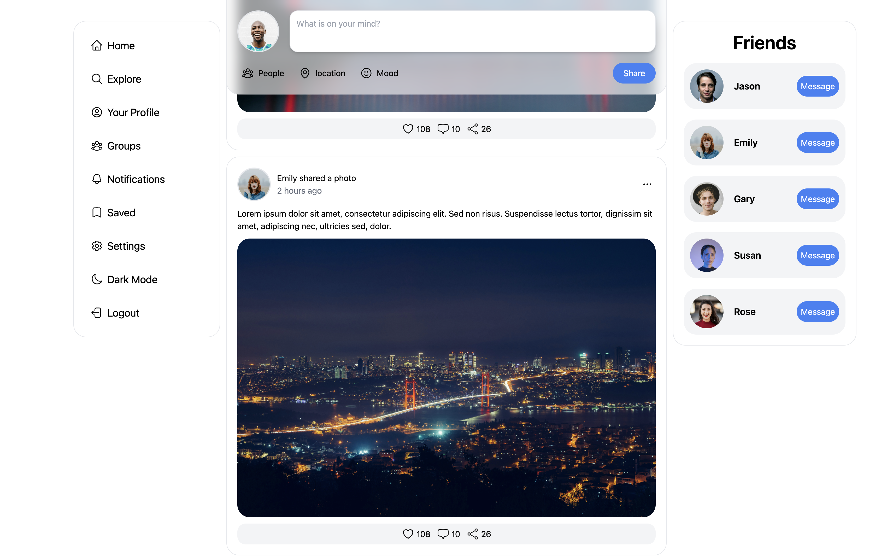
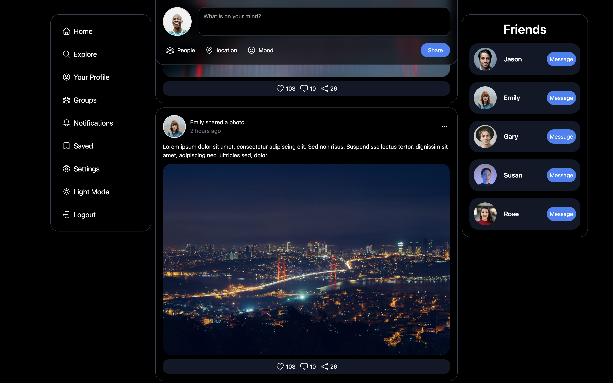

# Twitter-clone

A front-end project for a Twitter-clone application


## Screenshots






## Tech Stack

**Client:** vite + React, TailwindCSS

**Server:** This project do not use backend


## Installation

Install my-project with npm

```bash
  npm install Twitter-clone
  cd Twitter-clone
```
    
## Run Locally

Clone the project

```bash
  git clone https://gautierpicon.github.io/Twitter-clone/
```

Go to the project directory

```bash
  cd Twitter-clone
```

Install dependencies

```bash
  npm install
```

Start the server

```bash
  npm run start
```


## Deployment

To deploy this project run

```bash
  npm run deploy
```


## Credits

- svg icons : https://heroicons.com/
- base used : https://www.youtube.com/@HowtoWebDev


## Feedback

If you have any feedback, please add a issue on the GitHub
